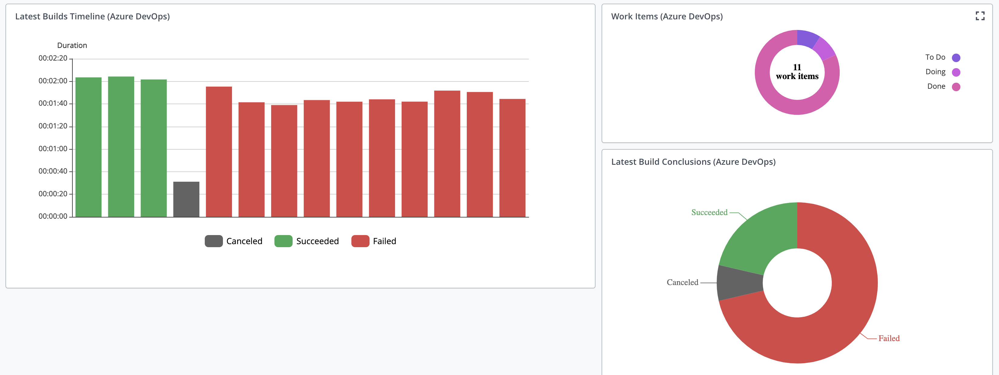
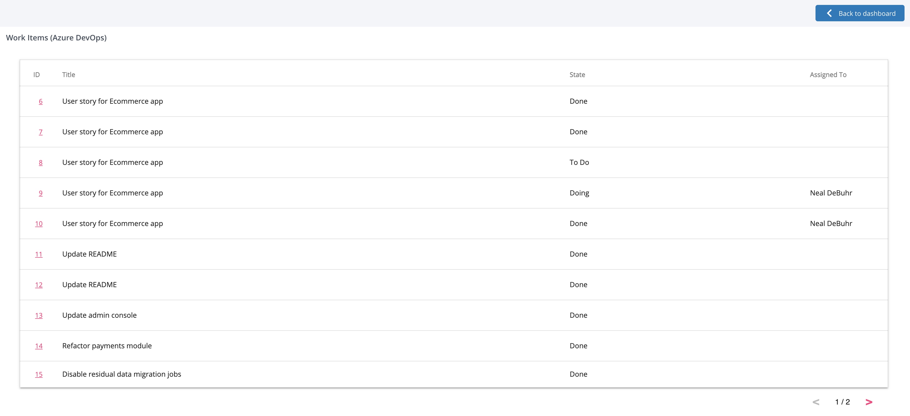

# VSTS Insights for XL Release


[](https://opensource.org/licenses/MIT)
[](https://github.com/xebialabs-community/xlr-vsts-insights-plugin/releases)
[](https://github.com/RichardLitt/standard-readme)

__This plugin is for additional community capabilities, on top of the official TFS/VSTS/ADO plugin.  At the moment, this community plugin provides only dashboard tiles.  Most teams will only use the official VSTS plugin, and will not use this plugin.__

## Installation

### Requirements

1. XL Release 9+
1. XL Release Official VSTS/TFS/ADO Plugin 9+

### Building the plugin
The gradle wrapper facilitates building the plugin.  Use the following command to build using [Gradle](https://gradle.org/):
```bash
./gradlew clean build
```
The built plugin, along with other files from the build, can then be found in the _build_ folder.

### Adding the plugin to XL Release

Download the latest version of the plugin from the [releases page](https://github.com/xebialabs-community/xlr-vsts-insights-plugin/releases).  The plugin can then be installed through the XL Release graphical interface or the server backend.  For additional detail, please refer to [the docs.xebialabs.com documentation on XLR plugin installation](https://docs.xebialabs.com/xl-release/how-to/install-or-remove-xl-release-plugins.html)

## Usage

__Available Tasks__: None

__Available Triggers__: None

__Available Dashboard Tiles__: Builds Tile, Builds Timeline Tile, Work Items Tile

### Tiles

#### Builds Tile
Properties:
* Tfs Server _input_ 
* Override Username _input_ 
   * Optionally, override the username used to connect to the server
* Override Password _input_ 
   * Optionally, override the password used to connect to the server
* Domain _input_ 
   * Domain in case of NTLM authentication
* Title  
   * Tile title
* Width  
* Height  
* Team Project Name _input_ 
* Build Definition Name _input_ 
* Count _input_ 
   * The number of latest builds to visualize

#### Builds Timeline Tile
Properties:
* Tfs Server _input_ 
* Override Username _input_ 
   * Optionally, override the username used to connect to the server
* Override Password _input_ 
   * Optionally, override the password used to connect to the server
* Domain _input_ 
   * Domain in case of NTLM authentication
* Title  
   * Tile title
* Width  
* Height  
* Team Project Name _input_ 
* Build Definition Name _input_ 
* Count _input_ 
   * The number of latest builds to visualize

#### Work Items Tile
Properties:
* Tfs Server _input_ 
* Override Username _input_ 
   * Optionally, override the username used to connect to the server
* Override Password _input_ 
   * Optionally, override the password used to connect to the server
* Domain _input_ 
   * Domain in case of NTLM authentication
* Title  
   * Tile title
* Width  
* Height  
* Query _input_ 
   * WIQL Query (Work Item Query Language)




## Contributing

Please review the contributing guidelines for _xebialabs-community_ at [http://xebialabs-community.github.io/](http://xebialabs-community.github.io/)

## License

This community plugin is licensed under the [MIT license](https://opensource.org/licenses/MIT).

See license in [LICENSE.md](LICENSE.md)
